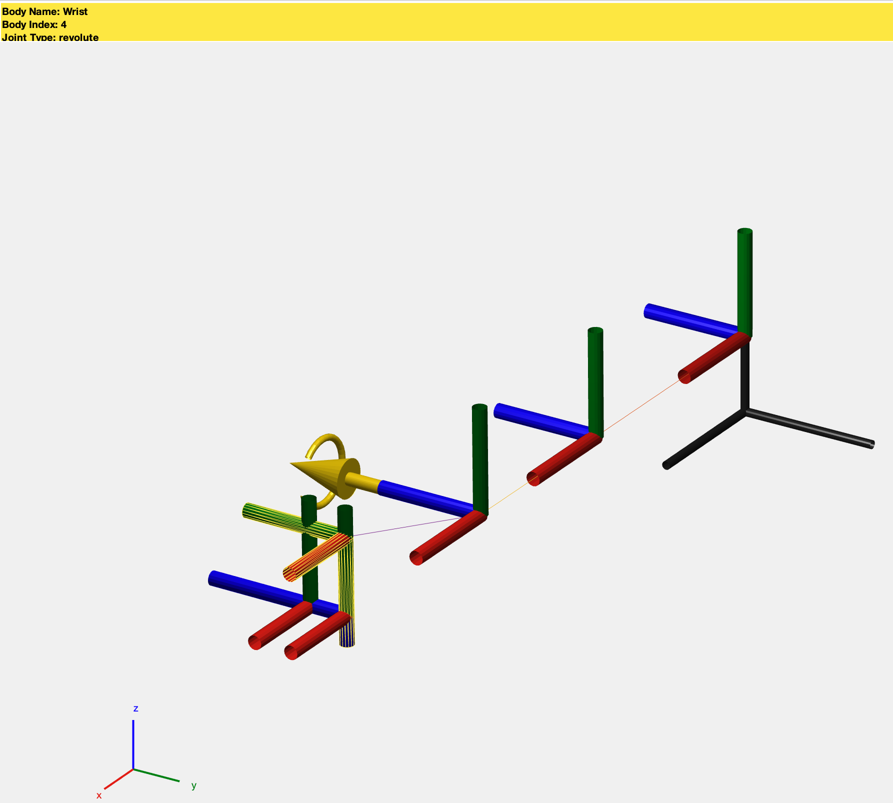

# SAM-Frames Image Gallery

Reference images for the 6-Axis Manipulator visualization.

Order: base to end effector, then assembled block at the end.

## Base

## Shoulder

## Elbow

## Wrist

## Wrist 2

## End Effector

## Main Block Assembly

## Final Block View

---
Last updated: 18 Nov 2025
