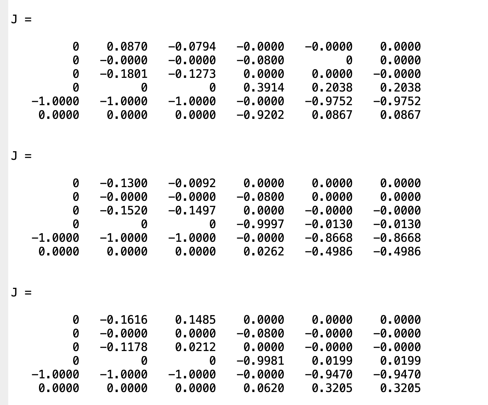

# 6-Axis Manipulator — Kinematics & Dynamics (MATLAB)

I’m documenting my MATLAB workspace where I play with forward kinematics, inverse kinematics (Newton–Raphson), and velocity propagation (including the geometric Jacobian) for a 6-DOF serial manipulator.

This is intentionally simple and self-contained so I can tweak DH parameters, visualize intermediate transforms, and iterate on IK quickly.

## What’s inside

- Forward Kinematics using DH parameters – generates individual transforms and the end-effector pose.
- Inverse Kinematics with a Newton–Raphson update – iteratively solves for joint angles that reach a desired pose.
- Velocity propagation – propagates angular and linear velocities through the chain and builds the 6×6 Jacobian.

The DH convention I’m using is: `[a_{i-1}, α_{i-1}, d_i, θ_i]`.

### 1) Forward Kinematics

- Script: [`FK_TransformationMat.m`](./FK_TransformationMat.m)
- What it does (in my words):
  - Builds a DH table for a 6-joint arm, constructs each Aᵢ transformation symbolically, and multiplies them to get T₀⁶.
  - Prints each intermediate transform (T01, T12, …) and the final pose `T0E`.
  - Extracts position `P = T(1:3,4)` and orientation axes `n, s, a` from the rotation part.
- Inputs/parameters:
  - Uses symbolic DH parameters `a1,a2,a3,d1,d2,d3,d4` and joint symbols `th1…th6`. The script sets `th1…th6 = 0` by default.
- Outputs:
  - Displays the transforms in the MATLAB console (`disp`), plus `P`, and the orientation vectors `n, s, a`.
- How I run it:
  - Open the script and hit Run. I change the DH parameters or joint values at the top and re-run to see the updated transforms.
- Visual notes:
  - 
  - 
  - 

---

### 2) Inverse Kinematics (Newton–Raphson)

- Script: [`IKNewtonRapson.m`](./IKNewtonRapson.m)
- What it does:
  - Solves IK iteratively using a Newton–Raphson style update, i.e., `q_{k+1} = q_k + pinv(J) * error`.
  - The error stacks position error and an orientation error built from the cross products of rotation axes.
  - Computes forward kinematics and the geometric Jacobian in a helper function inside the script.
- Inputs/parameters:
  - Robot link dimensions are defined at the top: `a1,a2,a3` and `d1..d4`.
  - Desired pose: `P_desired` (3×1) and `R_desired` (3×3).
  - Initial guess: `q = zeros(6,1)` by default.
  - Convergence control: `tol` and `max_iters`.
- Outputs:
  - Prints "Converged!" when the norm of the stacked error drops below tolerance, or a message if max iterations is reached.
  - You can also enable the (commented) `plotRobot(...)` for stepwise visualization.
- How I run it:
  - Open the script, adjust `P_desired`, `R_desired`, DH dimensions, or the initial `q`. Then Run.
  - If it’s not converging for a target, I try a different initial guess, scale down the update (e.g., damped least squares), or increase `max_iters`.
- Visual notes:
  - 
  - 
  - 

Implementation detail I keep in mind:
 
- The internal FK/Jacobian routine builds Aᵢ from the same DH convention and stacks the Jacobian as `[Jv; Jw]` with z-axes for revolute joints.

---

### 3) Velocity Propagation + Jacobian

- Script: [`VelocityPropagation.m`](./VelocityPropagation.m)
- What it does:
  - Reuses the FK setup to obtain each joint’s transform.
  - Propagates angular velocities `w` and linear velocities `v` from base to EE using standard rigid-body kinematics recursions.
  - Builds the 6×6 Jacobian `J = [Jv; Jw]` symbolically using `equationsToMatrix`.
- Inputs/parameters:
  - Symbolic `th1..th6` and their time-derivatives `th1dot..th6dot`.
  - DH parameters `a1..a3` and `d1..d4` (symbolic by default here).
- Outputs:
  - End-effector angular velocity `w06`, linear velocity `v06`, and the full Jacobian `J`.
- How I run it:
  - Run the script as-is to see symbolic expressions. I substitute numeric DH parameters and joint values when I want numbers instead of symbols.
- Visual notes:
  - 
  - 
  - 
  - 

## Quick start

- Requirements:
  - MATLAB (Symbolic Math Toolbox is needed for the FK and Jacobian scripts).
- How I typically use this folder:
  1. Start with forward kinematics: run [`FK_TransformationMat.m`](./FK_TransformationMat.m) and confirm the pose / axes look right for my DH choices.
  2. Try IK: run [`IKNewtonRapson.m`](./IKNewtonRapson.m) with a reachable `P_desired` and `R_desired`. Adjust `q` initial guess if needed.
  3. Explore velocities/Jacobians: run [`VelocityPropagation.m`](./VelocityPropagation.m), then substitute numeric values to get numeric `J` for a configuration.

## Notes I leave for myself

- DH order is `[a_{i-1}, α_{i-1}, d_i, θ_i]`. Be consistent when editing.
- The default joint values are zero in FK and VP scripts; update them if I want a different pose/velocity.
- The IK tolerance (`tol = 0.43`) is intentionally loose to show iteration; for tighter convergence, reduce it and/or increase `max_iters`.
- For numerically stable IK, using a damped pseudoinverse can help: `pinv(J'*J + λ^2 I) J'`.
