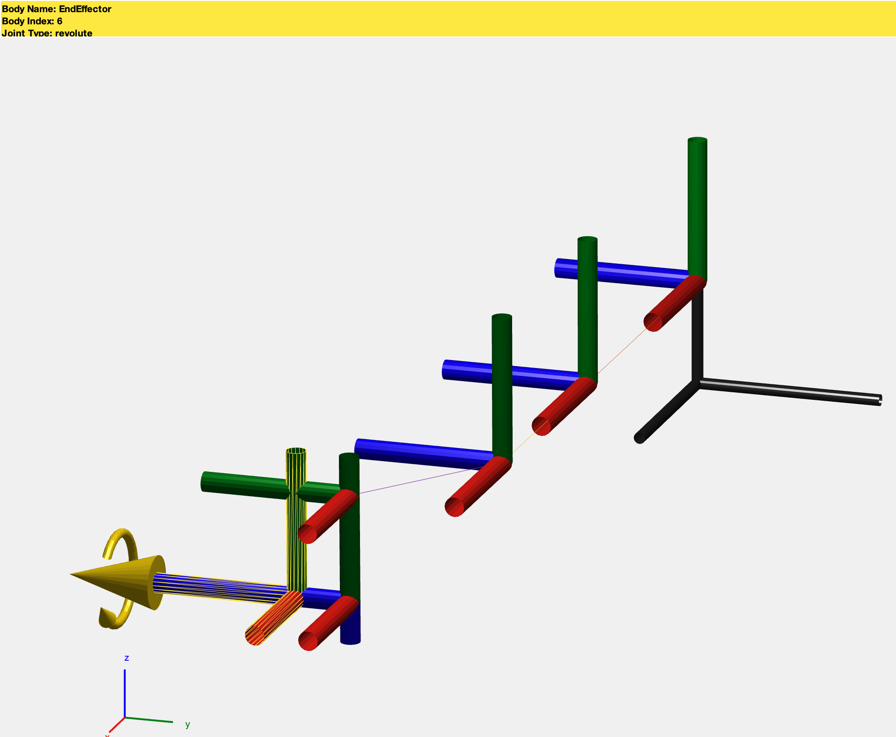
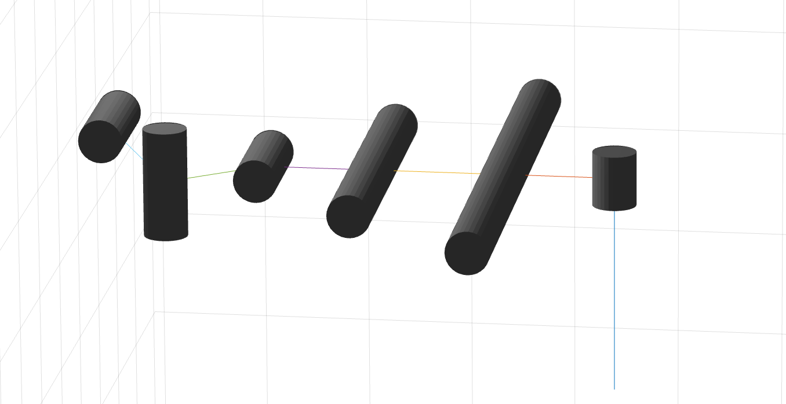
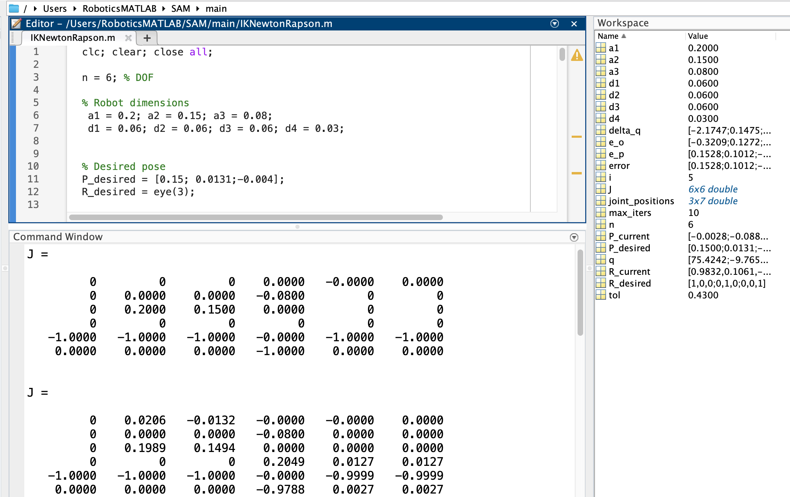
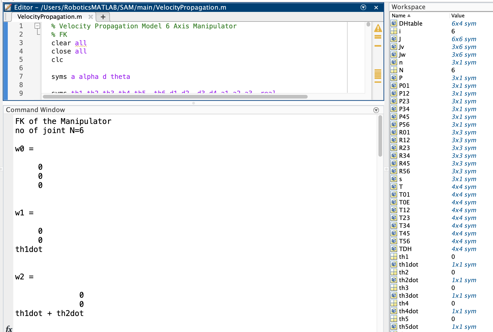
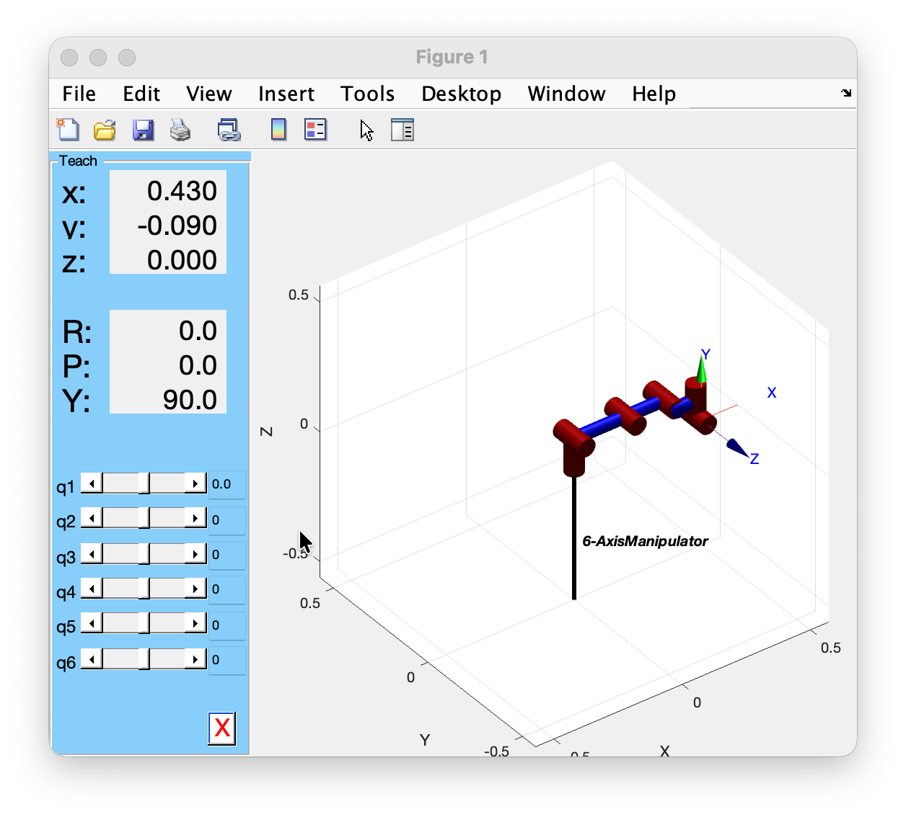
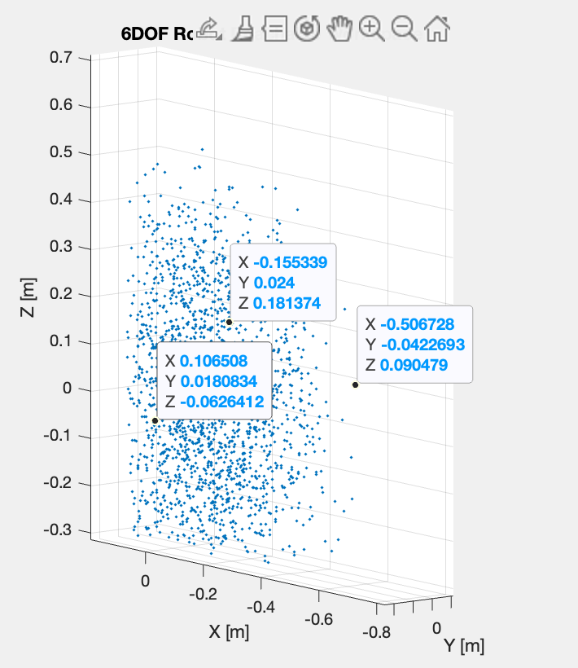

# 6-Axis Manipulator – MATLAB Workspace

Comprehensive MATLAB environment for a 6-DOF serial manipulator (revolute joints) covering forward/inverse kinematics, velocity/Jacobian derivations, visualization (frames, solid link blocks, GUI), reachable workspace sampling, and experimental scripts.  

> DH Convention used throughout: `[a_{i-1}, α_{i-1}, d_i, θ_i]` (Standard DH). Units: meters unless explicitly noted (some visualization block radii currently in mm-like scale).

---
### Key Scripts

* `SAM_Vis_Frames.m` – Defines DH in meters, builds a `rigidBodyTree` (`DataFormat='column'`), shows the robot, then calls `smimport(myRobot)` to auto-generate a Simscape model diagram.
* `SAM_Visualization_Frames.m` – Creates same chain (`DataFormat='row'`), focuses on clean frame visualization (camera zoom, axis limits, axis off, grid on). Good for validating DH orientation.
* `SAM_Visualization_Blocks.m` – Adds cylindrical visuals (`addVisual`) per link for presentation-style rendering. Radii/lengths presently look closer to mm scale; normalize if needed.

* `FK_TransformationMat.m` – Builds symbolic Aᵢ matrices from DH table, multiplies to get `T0E`. Outputs intermediate transforms (`T01`, `T12`, ...), end-effector pose, position vector `P`, and orientation axes (n, s, a).
* `IKNewtonRapson.m` – Newton–Raphson inverse kinematics: iteratively updates joint vector `q_{k+1} = q_k + pinv(J) * error` using position + orientation error (orientation from cross products of current vs desired axes). Adjustable tolerance `tol`, iteration limit `max_iters`.
* `VelocityPropagation.m` – Symbolic angular (`w`) and linear (`v`) velocity propagation through each frame; builds Jacobian (linear part `Jv`, angular part `Jw`) via `equationsToMatrix`. Also shows alternative (commented) partial derivative method.

---
## Frame-Visualization 

### ***[here](Frame-Visualization)***

  

 
 ---
 

 

---  

## Kinematics-Dynamics 
### ***[here](Kinematics-Dynamics)***

## Forward Kinematics
 

 
  
  ---  
  ## Inverse Kinematics
  
 

---  
## Velocity Propagation
 

## Robot-Visualization. 
### ***[here](Robot-Visualization)***

## GUI 
 

## Workspace
  

