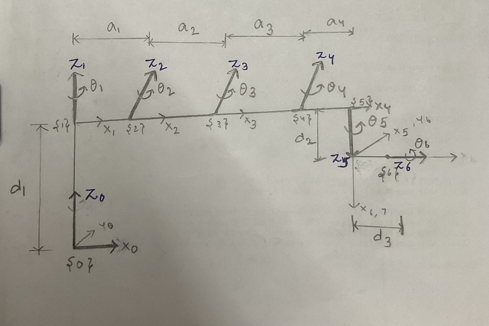
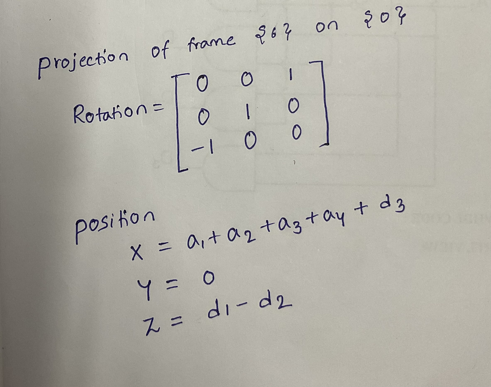

# *6-Axis Manipulator Project*

*Timeline: February 2025 - Present*
## **Project Overview**

Welcome to my 6-Axis Manipulator project! This is an in-depth analysis of how to build a robotic manipulator from the ground up. I began this project from scratch with emphasis on every part of designing, constructing, and programming the manipulator.  

In this repository, you will see everything that I have completed to date, including significant notes, drawings, and technical information provided in the Notes & Basics folder. The intention is to leave a well-documented path for others interested in learning about the design of a 6-axis robotic manipulator.
## **Table of Contents**
- [Linear Diagram](#linear-diagram)
- [DH Table](#Denavit-HartenbergDH-parameters)
- [Transformation Matrices](#transformation-matrices)
- [Arm Matrix](#arm-matrix-t0e)
- [Position Vector](#Position-Vector)
- [Normal Vector (XN Axis)](#normal-vector-xn-axis)
- [Sliding Vector (YN Axis)](#sliding-vector-yn-axis)
- [Approach Vector (ZN Axis)](#approach-vector-zn-axis)

## *Linear Diagram*



  ## *Projection of {6} on {0}*



# **Denavit-Hartenberg**(DH) parameters

| Link Length (a<sub>i-1</sub>) | Link Twist (α<sub>i-1</sub>) | Joint Offset (d<sub>i</sub>) | Joint Angle (θ<sub>i</sub>) |
|--------------------|-------------------|-------------------|-----------------|
| 0                | 0                 | d<sub>1</sub>     | θ<sub>1</sub> |
| a<sub>1</sub>    | -π/2            | 0                 | θ<sub>2</sub> |
| a<sub>2</sub>    | 0                 | 0                 | θ<sub>3</sub> |
| a<sub>3</sub>    | 0                 | 0                 | θ<sub>4</sub> |
| a<sub>4</sub>    | 3π/2            | d<sub>2</sub>     | θ<sub>5</sub> + 3π/2 |
| 0                | 3π/2            | d<sub>3</sub>     | θ<sub>6</sub> + 3π/2 |


## Transformation Matrices

### T<sub>01</sub>
```
[cos(th1), -sin(th1), 0,  0]
[sin(th1),  cos(th1), 0,  0]
[       0,         0, 1, d1]
[       0,         0, 0,  1]
```

### T<sub>12</sub>
```
[ cos(th2), -sin(th2), 0, a1]
[        0,         0, 1,  0]
[-sin(th2), -cos(th2), 0,  0]
[        0,         0, 0,  1]
```

### T<sub>23</sub>
```
[cos(th3), -sin(th3), 0, a2]
[sin(th3),  cos(th3), 0,  0]
[       0,         0, 1,  0]
[       0,         0, 0,  1]
```

### T<sub>34</sub>
```
[cos(th4), -sin(th4), 0, a3]
[sin(th4),  cos(th4), 0,  0]
[       0,         0, 1,  0]
[       0,         0, 0,  1]
```

### T<sub>45</sub>
```
[ cos(th5 + 3π/2), -sin(th5 + 3π/2), 0, a4]
[                   0,                    0, 1, d2]
[-sin(th5 + 3π/2), -cos(th5 + 3π/2), 0,  0]
[                   0,                    0, 0,  1]
```

### T<sub>56</sub>
```
[ cos(th6 + 3π/2), -sin(th6 + 3π/2), 0,  0]
[                   0,                    0, 1, d3]
[-sin(th6 + 3π/2), -cos(th6 + 3π/2), 0,  0]
[                   0,                    0, 0,  1]
```


## Arm Matrix (T<sub>0E</sub>)
```
T0E =
 
[cos(th2 + th3 + th4)*cos(th1)*sin(th5)*sin(th6) - sin(th2 + th3 + th4)*cos(th1)*cos(th6) - cos(th5)*sin(th1)*sin(th6), sin(th2 + th3 + th4)*cos(th1)*sin(th6) - cos(th5)*cos(th6)*sin(th1) + cos(th2 + th3 + th4)*cos(th1)*cos(th6)*sin(th5), sin(th1)*sin(th5) + cos(th2 + th3 + th4)*cos(th1)*cos(th5), d3*(sin(th1)*sin(th5) + cos(th2 + th3 + th4)*cos(th1)*cos(th5)) + cos(th1)*(a1 + a3*cos(th2 + th3) + a2*cos(th2) + a4*cos(th2 + th3 + th4) - d2*sin(th2 + th3 + th4))]
[cos(th1)*cos(th5)*sin(th6) - sin(th2 + th3 + th4)*cos(th6)*sin(th1) + cos(th2 + th3 + th4)*sin(th1)*sin(th5)*sin(th6), sin(th2 + th3 + th4)*sin(th1)*sin(th6) + cos(th1)*cos(th5)*cos(th6) + cos(th2 + th3 + th4)*cos(th6)*sin(th1)*sin(th5), cos(th2 + th3 + th4)*cos(th5)*sin(th1) - cos(th1)*sin(th5), sin(th1)*(a1 + a3*cos(th2 + th3) + a2*cos(th2) + a4*cos(th2 + th3 + th4) - d2*sin(th2 + th3 + th4)) - d3*(cos(th1)*sin(th5) - cos(th2 + th3 + th4)*cos(th5)*sin(th1))]
[                                             - cos(th2 + th3 + th4)*cos(th6) - sin(th2 + th3 + th4)*sin(th5)*sin(th6),                                                cos(th2 + th3 + th4)*sin(th6) - sin(th2 + th3 + th4)*cos(th6)*sin(th5),                             -sin(th2 + th3 + th4)*cos(th5),                                           d1 - a3*sin(th2 + th3) - a2*sin(th2) - d2*cos(th2 + th3 + th4) - a4*sin(th2 + th3 + th4) - d3*sin(th2 + th3 + th4)*cos(th5)]
[                                                                                                                    0,                                                                                                                     0,                                                          0,                                                                                                                                                                     1]
```
### Position Vector
P =
 ```
d3*(sin(th1)*sin(th5) + cos(th2 + th3 + th4)*cos(th1)*cos(th5)) + cos(th1)*(a1 + a3*cos(th2 + th3) + a2*cos(th2) + a4*cos(th2 + th3 + th4) - d2*sin(th2 + th3 + th4))
sin(th1)*(a1 + a3*cos(th2 + th3) + a2*cos(th2) + a4*cos(th2 + th3 + th4) - d2*sin(th2 + th3 + th4)) - d3*(cos(th1)*sin(th5) - cos(th2 + th3 + th4)*cos(th5)*sin(th1))
                                          d1 - a3*sin(th2 + th3) - a2*sin(th2) - d2*cos(th2 + th3 + th4) - a4*sin(th2 + th3 + th4) - d3*sin(th2 + th3 + th4)*cos(th5)
```
## **Normal Vector (XN Axis)**
n =
``` 
cos(th2 + th3 + th4)*cos(th1)*sin(th5)*sin(th6) - sin(th2 + th3 + th4)*cos(th1)*cos(th6) - cos(th5)*sin(th1)*sin(th6)
cos(th1)*cos(th5)*sin(th6) - sin(th2 + th3 + th4)*cos(th6)*sin(th1) + cos(th2 + th3 + th4)*sin(th1)*sin(th5)*sin(th6)
                                             - cos(th2 + th3 + th4)*cos(th6) - sin(th2 + th3 + th4)*sin(th5)*sin(th6)
 
 ```
## **Sliding Vector (YN Axis)**
s =
 ```
sin(th2 + th3 + th4)*cos(th1)*sin(th6) - cos(th5)*cos(th6)*sin(th1) + cos(th2 + th3 + th4)*cos(th1)*cos(th6)*sin(th5)
sin(th2 + th3 + th4)*sin(th1)*sin(th6) + cos(th1)*cos(th5)*cos(th6) + cos(th2 + th3 + th4)*cos(th6)*sin(th1)*sin(th5)
                                               cos(th2 + th3 + th4)*sin(th6) - sin(th2 + th3 + th4)*cos(th6)*sin(th5)
```
## **Approach Vector (ZN Axis)**
a =
 ```
sin(th1)*sin(th5) + cos(th2 + th3 + th4)*cos(th1)*cos(th5)
cos(th2 + th3 + th4)*cos(th5)*sin(th1) - cos(th1)*sin(th5)
                            -sin(th2 + th3 + th4)*cos(th5)


```


